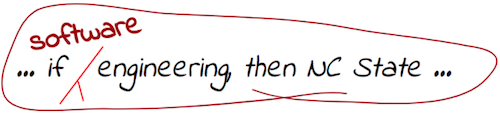

<br clear=right>

# Foundations of Software Science
## Fall 2018

For full documentation visit [mkdocs.org](https://mkdocs.org).

## Commands

* `mkdocs new [dir-name]` - Create a new project.
* `mkdocs serve` - Start the live-reloading docs server.
* `mkdocs build` - Build the documentation site.
* `mkdocs help` - Print this help message.

## Project layout

    mkdocs.yml    # The configuration file.
    docs/
        index.md  # The documentation homepage.
        ...       # Other markdown pages, images and other files.

```lua
local function a(x,y)
  return 2+a -- 
end
```
