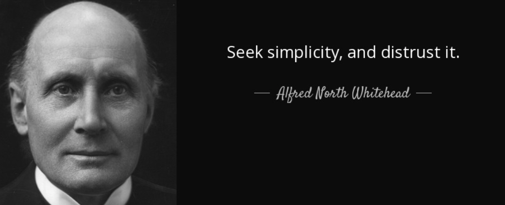

# Simpler. Please.

## Enough Inference, But Not Too Much

"As complexity rises, precise statements lose meaning and meaningful statements lose precision."  
-- Lofti Zadeh

"Simplicity is the ultimate form of sophistication."    
-- Leonardo da Vinci

"No! No! No!"   
-- Business user running in fear from overly complex maths

"Less, But Better"       
-- Dieter Rams

<small class="sidenote">
Are our AI tools designed "good"? Based on my experience with industrial developers,
I would say perhaps not.
</small>According to Dieter Rams, good design:

- **is innovative** – The possibilities for progression are not, by any means, exhausted. Technological development is always offering new opportunities for original designs. But imaginative design always develops in tandem with improving technology, and can never be an end in itself.
- **makes a product useful** – A product is bought to be used. It has to satisfy not only functional, but also psychological and aesthetic criteria. Good design emphasizes the usefulness of a product whilst disregarding anything that could detract from it.
- **is aesthetic** – The aesthetic quality of a product is integral to its usefulness because products are used every day and have an effect on people and their well-being. Only well-executed objects can be beautiful.
- **makes a product understandable** – It clarifies the product’s structure. Better still, it can make the product clearly express its function by making use of the user's intuition. At best, it is self-explanatory.
- **is unobtrusive** – Products fulfilling a purpose are like tools. They are neither decorative objects nor works of art. Their design should therefore be both neutral and restrained, to leave room for the user's self-expression.
- **is honest** – It does not make a product appear more innovative, powerful or valuable than it really is. It does not attempt to manipulate the consumer with promises that cannot be kept.
- **is long-lasting** – It avoids being fashionable and therefore never appears antiquated. Unlike fashionable design, it lasts many years – even in today's throw away society.
- **is thorough down to the last detail** – Nothing must be arbitrary or left to chance. Care and accuracy in the design process show respect towards the consumer.
- **is environmentally friendly** – Design makes an important contribution to the preservation of the environment. It conserves resources and minimizes physical and visual pollution throughout the life cycle of the product.
- **is as little design as possible** – Less, but better – because it concentrates on the essential aspects, and the products are not burdened with non-essentials. Back to purity, back to simplicity.

## The Obvious Counter-argument Against "Keep it Simple"

Yes, sometimes, complexity is necessary

- e.g. 2% optimizations of turbulent non-linear air-flows across a wing in the transonic range

But when it ain’t

- Needless complexity = is just silliness

Much industrial success with very complex image processing based on deep learners that 
derive fascinating internal features uses layers of neural nets

- All good stuff
- For "large &epsilon; problems", ever increasing
exact inference is... silly.

Example of "large &epsilon;":

- Many SE inference results a large &epsilon; i.e. small changes to the training data
or the AI model leads to large changes in the performance.
<small class="sidenote">
77 not different to  79 when  variance is &pm; large; and for SE, its often large.
</small>
- For example, here are 10\*3 cross-val software effort estimation
results (10 times: randomize order of data,
divide into three bins; train on 2, test on the other):

And there are many reasons to reflect on how not to do "it" simpler.

## Reasons for less

### Your next 15 weeks

- Fewer headaches
- Higher marks

### Because at least in SE, there are  inherent simpliticies

And we would be foolish not to exploit them.

Why is this so? Not clear. But:

- Mathematically, models are either simple or poorly supported by the data:
      - See [here](http://menzies.us/lessdata.html)
- Programming languages are a subset of natural language and both kinds of
  languages exhibit remarkably [simple "language models"](https://arxiv.org/pdf/1709.06182.pdf); i.e. given the last
  N symbols, you can pretty much guess the next symbol.
      - [Hindle et al.](http://web.cs.ucdavis.edu/~su/publications/natural.pdf): 
         "Programming languages, in theory, are complex, flexible and powerful, but the programs that real people actually write are mostly simple and rather repetitive, and thus they have usefully predictable statistical proper- ties that can be captured in statistical language models and leveraged for software engineering tasks."

### Because in SE, More Complex is often superfluous

Data from Norman Fenton’s Bayes nets discussing software defects = yes, no

- Given classes x,y then Fx, Fy is frequency of some ranges in x,y
    - Log Odds Ratio = log(Fx/Fy )
    - If zero  if no difference in x,y
- Results:
    - Most variables do not contribute to determination of defects

Data from [Papakroni](https://oatd.org/oatd/record?record=oai%5C%3Awvuscholar.wvu.edu%5C%3A28332)'s masters thesis

- TRAIN:
Project 21 features onto first 2 components of PCA
    - Recursively divide two dimensions (at median)
    - Stopping a SQRT(N)
    - In each leaf, replace N projects with median centroid
- TEST: Estimate = interpolate 2 near centroids
- Performs no worse, and sometimes better, than Random forests, NaiveBayes

For more, see [Data Mining for very busy people](http://menzies.us/pdf/03tar2.pdf)

### Because, Historically, Simpler is often Better

- PCA, 1901
- Narrows: Amarel 1960s
- Prototypes: Chen 1975 
- Frames: Minsky, 1975
- Min environments: DeKleer, 1986
- Saturation: Horgan & Mathur: 1980
- Homogeneous propagation: Michael: 1981
- Master variables: Crawford & Baker, 1995
- Clumps, Druzdel, 1997
- Feature subset section, Kohavi, 1997, 
- Back doors, Williams, 2002 
- Active learning: many people (2000+)

From Section 2.2 of [this paper](https://arxiv.org/pdf/1803.05067.pdf)

- Simpler methods may build smaller  models that
use fewer attributes from the data. Such models are more likely
to be robust against overfitting, especially on small and noisy data
(and have been found to predict data at levels comparable with regression).
- Very simple rule-based methpds can perform comparably well to more complex models in a range of domains e.g., public health, medical risk management, performance sci- ence, etc.
- Neth and Gigerenzer argue that such rule-bases are tools that work well under conditions of uncertainty.
- Brighton showed that rule-based models can perform better than complex nonlinear algorithms such as neural networks, exemplar models, and classification/regression trees.

### Speed speed speed

- Analytics =   work flow to condense much  low-value data down to a few diamonds.
- [Fisher et al.](https://www.microsoft.com/en-us/research/wp-content/uploads/2016/02/inteactions_big_data.pdf)  survey of  16 industrial data scientists,
     - Due to computational cost of   analytics, "the luxuries of interactivity, direct manipulation, and fast system response are gone".
     - Modern cloud-based analytics as a throwback to the 1960s– batch processing
     - "Fast iteration is key, but incompatible with the way jobs are submitted and processed in the cloud. It’s frustrating to wait for hours, only to realize you need a slight tweak to your feature set."

### Less cost (local hardware, cloud services)

The following  are somewhat extreme examples. But suppose we could do the following  tasks
orders of magnitude faster. Just imagine what else could we use all that saved CPU for?

- 15 years of CPU, one FSE 2013 analytics paper, [Wang et al/](http://citeseerx.ist.psu.edu/viewdoc/download?doi=10.1.1.565.1058&rep=rep1&type=pdf) 
     - Evaluate automatic tuning tools for code clone recognition tools
 - $1.2million
     - Cost or renting of commercial cloud hardware
     - One project, 5 students, 3 years
     - FYI: that would **EAT** and **SWALLOW** the standard budgets NSF gives researchers like me
- Three years of CPU/day
    - Anonymous NCSU grad student tuning deep learning networks at XXXX for summer 2018

### Support the edge

- [Edge computing](https://arxiv.org/pdf/1609.01967.pdf)
     - Move some computational towards the edge of the network to harness computational capabilities that are currently untapped in edge nodes, such as base stations, routers and switches
- [Internet of Things](https://www.wired.co.uk/article/internet-of-things-what-is-explained-iot)
     - Simple AI could  make better use of billions and billions of low power devices, many of
       which are operating at very low power

### Less Energy Consumption

Power off your phone

- Stare at it 
- How long before you stop?
- Phone - power = silly

From [Green in Software Engineering](https://www.springer.com/us/book/9783319085807):

- Present-day primary energy footprints of three business software apps add up to as much as 373 Peta Joules/ year.
- People claim   they will pay more for a "green"  product.
- nearly half of surveyed organizations design their business models on the basis of sustainability.
- Sustainability =  new source of innovation, cost-cutting opportunity , mechanism for gaining competitive advantage.

### Less pollution Creating that Energy

- IT-related services now account for 2% of all global carbon emissions-- roughly the same as the aviation sector
- Simpler AI lets us breathe easier.
     - The cloud runs on [http://time.com/46777/your-data-is-dirty-the-carbon-price-of-cloud-computing/](dirty coal). 

### Simpler explanation

Less generation of  solutions

- Less confusion
-  [Verrappa and Letier](https://goo.gl/LvsQdn):
       - "..for  industrial problems, these  algorithms generate (many) solutions (makes) understanding them and selecting one among them difficult  and time consuming" 

### Simpler Customization

We are already delivering software [more complex than what people can manage](https://pdfs.semanticscholar.org/ad8d/b361ddd6032526301e79553623fd3f22ca0b.pdf) (see fig1 and fig3).

- Many software systems have poorly chosen defaults. Hence, it is useful to seek better configurations.
     - [Van Aken et al.](https://www.cs.cmu.edu/~ggordon/van-aken-etal-parameters.pdf)  report that the default MySQL configurations in 2016 assume that it will be installed on a machine that has 160MB of RAM (which, at that time, was incorrect by, at least, an order of magnitude)
     - [Herodotou et al.](http://cidrdb.org/cidr2011/Papers/CIDR11_Paper36.pdf) show how standard settings for text mining appli- cations in Hadoop result in worst-case execution times. 
     - In the same vein, [Jamshidi et al.](https://arxiv.org/pdf/1606.06543.pdf) reports for text mining applications on Apache Storm, the throughput achieved using the worst configuration is 480 times slower than the throughput achieved by the best configuration.
- Understanding, the configuration space of software systems with large configuration space, is challenging.
- Exploring more than just a handful of configurations is
usually infeasible due to long benchmarking time

### Because we need a baseline

Because better science needs better baselines:

- [Empirical methods in AI](http://www.eecs.harvard.edu/cs286r/courses/spring08/reading6/CohenTutorial.pdf):
    - Supposedly newer more sophisticated methods should be baselined against a seemingly
simpler alternative
    - Warning: when I do that, I often find simpler is better.
         - Search-based SE: [A Baseline Method For Search-Based Software Engineering](http://greggay.com/pdf/10baseline.pdf)
         - Data mining: [Bellwethers: A Baseline Method For Transfer Learning](https://arxiv.org/pdf/1703.06218)
         - Optimizing: ["Sampling"' as a Baseline Optimizer for Search-based Software Engineering](https://arxiv.org/pdf/1608.07617)

Because better engineering needs better baselines:

- So many AI tools, so many ways to tune them, so many ways to combine them
       - So given a new problem, which learner/optimizer should we apply? 
       - Hard to say, apriori.
       - When new data arrives, you need _commissioning experiments_; i.e. try a variety of techniques before you can
find what words best for the local data.
- Comissioning needs baselines
	- i.e. an algorithm which can generate floor performance values. 
	- Lets a developer quickly rule out any method that falls “below the floor”. 
	- Lets us achieve fast early results, while also gaining some guidance in all their subsequent experimentation (specifically: "try to beat the baseline").

### Other

Quicker more effective training, experimentation

- Less to understand, faster to understand.
- Less to twiddle, less to explore

Easier Reproducibility

- Large config spaces are the bane of reproducibility.
- You did not get what I got? Di you set the X to 2, Y to 3, and Z  to 10,30,age/shoe size+temperature?

Solutions more trust-able

- More understandable, more explainable, more I want to use.

Solutions easier to apply

- Less to do, faster to do

Cause its just good science

- If we do not know what we are doing, we are very clumsy;
- When we understand it better, we are more elegant;
- So use this test to check if your thinking is confused, or clarified:
    - are your current methods very complex/ time-consuming?

## A Common Recipe (For Me, at Least)

- Row reduction:
     - Replace N rows of data with M&Lt;N exemplars
     - e.g. cluster and report just some items per cluster
- Column reduction:
     - Prune C columns of data with the _sqrt(C)_ most influential columns
- Range reduction (in columns):
    - Discretize numerics, but only cut into ranges in sub-ranges have less variance 
- Range pruning
    - If there is a class variable:
         - only cut if the associated class ranges are less varied
    - Else, cluster row/column/range data and only cut if
          associated ranges are less varied in different clusters.

## Cautions

So that’s it? Just find the few 
dimensions that matter, then stop?o

Well...

- The reduced data space exists... but how to find it?
     - Feature selection on raw data?
     - Or may be synthesized (PCA, spectral, etc)

Also:

- And the dimensions that matter NOW 
     - May not matter SOON
- So an agent that assumes low dimensionality
    -  <small class="sidenote"> (but fyi, we should
       be doing that with all data mining approaches, anyway).</small>
     Will always be checking and  revising their dimensional 

